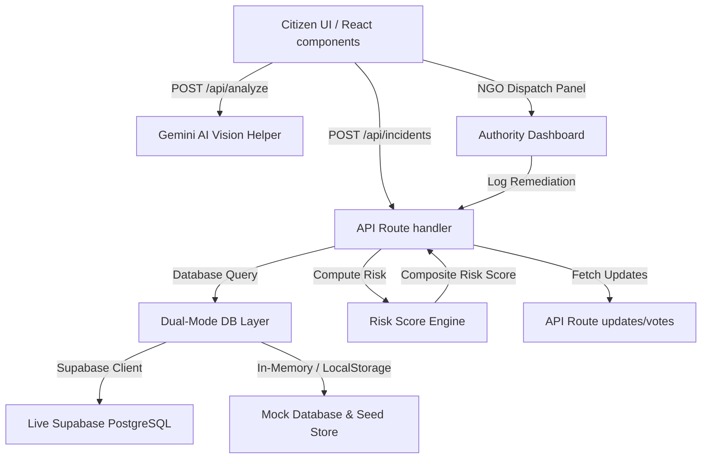

# TerraMind AI — AI-Powered Environmental Intelligence Network

> **Dev Season of Code (DSOC) – Summer Edition 2026**

TerraMind AI is a startup-grade SaaS platform designed to transition environmental hazard monitoring from reactive reporting to predictive, validated, and coordinates-driven ecological intelligence. 

Designed for communities, NGOs, and environmental protection agencies, TerraMind AI automates threat classification using computer vision, maps localized risks using a five-factor mathematical model, and forecasts incident clusters using custom time-series analytics.

---

## 🚀 Key Innovation Highlights

### 1. Computer Vision Diagnostics (Gemini Vision AI)
When citizens upload incident photos (debris, water discharge, logging, flares), the platform invokes the **Gemini Vision API** (or falls back to an intelligent mock simulation) to:
- Instantly classify the threat type.
- Gauge the inspection confidence percentage.
- Assess severity index levels (`Low`, `Moderate`, `High`, `Critical`).
- Outline the direct ecological consequences.
- Recommend detailed remediation/cleanup guides for authorities.

### 2. Composed 3-Month Time-Series Forecasting
Using custom statistical models exposed via `/api/predict`, the platform:
- Analyzes regional history to plot future incident counts over a 3-month window.
- Visualizes trends with composite area and trend line charts using **Recharts**.
- Identifies predictive coordinate centers showing high probability of future hazards.

### 3. Five-Factor Risk Engine
Prioritizes reports using a composite score $R \in [0, 100]$:
$$R = \text{clip}\left( 3.5 \cdot S + 1.5 \cdot V + 2.0 \cdot P + 2.0 \cdot E + 1.0 \cdot F, \, 0, \, 100 \right)$$
Where:
- $S$: Gemini Severity Level ($[2, 10]$)
- $V$: Community Validation Index ($[-5, 10]$)
- $P$: Proximity Population Density ($[1, 10]$)
- $E$: Environmental Sensitivity Coefficient ($[1, 10]$)
- $F$: Neighboring Incident Frequency ($[1, 10]$)

### 4. Laplace Consensus Trust Scoring
Leverages Laplace smoothing to prevent manipulation and divide-by-zero errors in community validation:
$$T = \frac{\text{confirms} + 1}{\text{confirms} + \text{disputes} + 2} \times 100$$
Ensures initial reports with zero votes sit safely at a baseline of $50\%$ trust, dynamically scaling as verification arrives.

### 5. NGO & Government Command Portal
Verifying authorities can assign incidents to their agency, allocate specific resources (e.g. soil kits, waste trucks), and log progress. It features:
- **Remediation Metrics**: Logs waste removed (kg), area restored (sqm), and risk reduction percentages.
- **Priority Dispatch Queues**: Auto-prioritized by risk score, allowing rapid routing of critical incidents.

---

## 🛠 System Architecture



---

## 📂 Codebase Structure

```
terramind-ai/
├── src/
│   ├── app/
│   │   ├── page.tsx               # Rebranded Palantir-inspired SaaS Landing Page
│   │   ├── layout.tsx             # Root layout with Theme and Auth Providers
│   │   ├── globals.css            # Base Tailwind definitions + Glassmorphism animations
│   │   ├── login/ & signup/       # Rebranded auth screens
│   │   ├── report/                # GPS reporting wizard with Live Gemini Vision audit
│   │   ├── reports/               # Incident registries with Laplace trust scoring
│   │   │   └── [id]/              # Details timeline, voting panels, and cleanup tracking
│   │   ├── dashboard/             # Recharts command center, predictive heatmap grids
│   │   │   └── authority/         # NGO/Gov agency dispatch portal
│   │   └── api/
│   │       ├── incidents/         # GET/POST reports & updates endpoints
│   │       ├── analyze/           # Quick AI image diagnostic scanner
│   │       └── predict/           # 3-month forecast models & coordinates generator
│   ├── components/
│   │   ├── navigation.tsx         # Modern tech header navigation
│   │   ├── leaflet-map.tsx        # High-density Leaflet map displaying active/predicted pins
│   │   ├── theme-provider.tsx     # Theme wrapper with client hydration safety
│   │   └── auth-provider.tsx      # Dual-mode authentication store
│   ├── lib/
│   │   ├── db.ts                  # Dual-mode Supabase/memory database manager
│   │   ├── gemini.ts              # Gemini Generative AI SDK wrapper
│   │   └── risk.ts                # Five-factor risk scoring engine
│   └── types/
│       └── index.ts               # Core TypeScript definitions (includes RecoveryStatus)
├── schema.sql                     # Supabase tables setup scripts (9 tables)
├── package.json
└── tsconfig.json
```

---

## ⚙️ Local Setup & Installation

### Prerequisites
*   Node.js (v18+) and npm installed.

### Steps
1.  **Navigate** to the project directory:
    ```bash
    cd terramind-ai
    ```
2.  **Install dependencies**:
    ```bash
    npm install
    ```
3.  **Setup environment files**:
    Create a `.env.local` file in the root directory:
    ```env
    # Gemini API Key (Optional, fallback simulations will execute if empty)
    GEMINI_API_KEY=your_gemini_api_key_here

    # Supabase Credentials (Optional, database runs in mock memory mode if empty)
    NEXT_PUBLIC_SUPABASE_URL=https://your-ref.supabase.co
    NEXT_PUBLIC_SUPABASE_ANON_KEY=your-anon-key
    SUPABASE_SERVICE_ROLE_KEY=your-service-role-key
    ```
4.  **Run Development Server**:
    ```bash
    npm run dev
    ```
    Open `http://localhost:3000` to review the application.

5.  **Build Production Bundle**:
    ```bash
    npm run build
    ```

---

## 🛡 License
This project is licensed under the MIT License. Developed for the Dev Season of Code (DSOC) – Summer Edition 2026.
